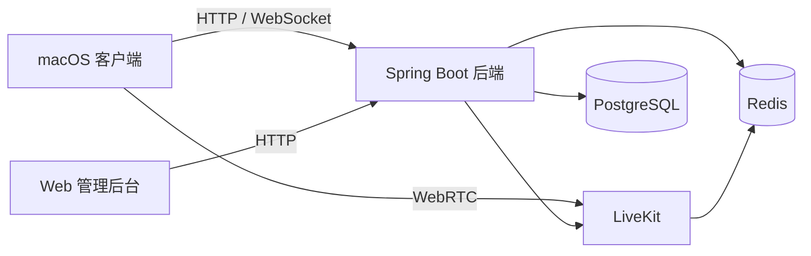

# MeetHarbor

> 开源、可自托管的远程会议系统。


MeetHarbor 提供 macOS 原生会议客户端、Web 管理后台和完整的服务端部署方案。音视频能力基于 LiveKit，业务后端使用 Spring Boot，所有服务可通过 Docker Compose 一键启动。

项目目前处于早期开发阶段，适合本地体验、局域网部署、学习和二次开发。

## 功能

### macOS 客户端

- 用户登录、退出及凭据安全存储
- 创建即时会议和预约会议
- 通过会议号加入、离开及断线重连
- LiveKit 实时音频通话
- 麦克风静音状态同步
- macOS 主屏幕共享
- 参会人、会议历史和录制记录查看
- WebSocket 会议状态信令

### Web 管理后台

- 用户创建、启停、昵称修改及密码重置
- 在线会议和历史会议管理
- 录制记录管理
- 操作日志查询
- 服务状态及主机资源概览

### 服务端

- JWT 登录认证与管理员权限控制
- 会议、成员和会话生命周期管理
- LiveKit 房间创建、删除、令牌签发及 Webhook 接收
- PostgreSQL 持久化和 Redis 状态存储
- Docker 健康检查、数据卷和随机密钥初始化

## 系统架构



| 组件 | 技术 |
| --- | --- |
| macOS 客户端 | Swift 6、SwiftUI、LiveKit Swift SDK |
| 管理后台 | Vue 3、TypeScript、Vite、Element Plus |
| 业务后端 | Java 21、Spring Boot 3、Spring Security、JPA |
| 实时音视频 | LiveKit |
| 数据服务 | PostgreSQL 16、Redis 7 |
| 部署 | Docker Compose |

## 快速开始

### 环境要求

- Linux 或 macOS
- Docker Engine 24+ 或 Docker Desktop
- Docker Compose 插件

### 一键启动全部服务

```bash
git clone https://github.com/indeedworks/meet-harbor.git
cd meet-harbor
./docker/install.sh
```

安装脚本会自动检测本机局域网地址、生成服务密钥和初始管理员密码，并启动 PostgreSQL、Redis、LiveKit、后端及管理后台。

启动完成后访问：

| 服务 | 默认地址 |
| --- | --- |
| Web 管理后台 | <http://localhost:8088> |
| 后端 API | <http://localhost:8080> |
| LiveKit | `ws://localhost:7880` |

管理员账号和随机生成的密码保存在 `docker/.env`：

```bash
grep -E '^ADMIN_(ACCOUNT|PASSWORD)=' docker/.env
```

如需让局域网内其他设备访问，可在首次启动时指定宿主机地址：

```bash
PUBLIC_HOST=192.168.1.10 ./docker/install.sh
```

### 公网地址与 LiveKit 地址

`PUBLIC_HOST` 是客户端能够访问到的服务器地址，配置保存在 `docker/.env`。该值只填写 IP 或域名，不包含 `http://`、`ws://` 或端口。

```dotenv
PUBLIC_HOST=47.93.100.194
```

Docker Compose 会根据它自动生成两个用途不同的 LiveKit 地址：

| 配置 | 默认值 | 用途 |
| --- | --- | --- |
| `LIVEKIT_URL` | `ws://${PUBLIC_HOST}:7880` | 后端返回给 macOS 等外部客户端的媒体服务地址 |
| `LIVEKIT_INTERNAL_URL` | `ws://livekit:7880` | 后端容器访问 LiveKit 容器的内部控制地址 |

外部客户端不能使用 Docker、VPC 或局域网内网地址，例如 `172.17.x.x`、`10.x.x.x` 或 `192.168.x.x`。云服务器应将 `PUBLIC_HOST` 设置为公网 IP 或可公网解析的域名。

安装脚本只在首次运行时创建 `docker/.env`。如果文件已经存在，请直接修改它，然后重建 LiveKit 和后端，使地址生效：

也可以使用一键脚本。它支持公网 IP、域名以及带协议的完整地址，会同步更新后端邀请链接和 LiveKit 公网地址，并重建管理端以刷新 Nginx 的后端地址解析：

```bash
./docker/update-public-host.sh 47.93.100.194
./docker/update-public-host.sh meeting.example.com
./docker/update-public-host.sh https://meeting.example.com
```

不传参数时，脚本会交互式询问新地址：

```bash
./docker/update-public-host.sh
```

输入 `https://` 时脚本会将媒体地址切换为 `wss://`。使用 HTTPS/WSS 前仍需提前配置证书和反向代理。

也可手动修改：

```bash
sed -i 's/^PUBLIC_HOST=.*/PUBLIC_HOST=你的公网IP或域名/' docker/.env

docker compose --env-file docker/.env -f docker/compose.yml \
  up -d --force-recreate livekit backend admin-web
```

可以通过以下命令确认容器实际加载的地址：

```bash
grep '^PUBLIC_HOST=' docker/.env

docker compose --env-file docker/.env -f docker/compose.yml \
  exec backend printenv LIVEKIT_URL
```

macOS 客户端中的“服务端地址”是后端 API 地址，例如 `http://47.93.100.194:8080`；加入会议后，客户端会从后端响应中自动取得 `LIVEKIT_URL`，无需在客户端单独填写 LiveKit 地址。

完整的配置、升级、日志和数据清理说明见 [Docker 部署文档](docker/README.md)。

## 运行 macOS 客户端

客户端要求 macOS 14+ 和 Swift 6。请先启动服务端，然后执行：

```bash
cd sources/macos-client
swift run
```

首次使用麦克风或屏幕共享时，macOS 会请求相应的系统权限。客户端默认连接 `http://localhost:8080`。

更多说明见 [macOS 客户端文档](sources/macos-client/README.md)。

## 常用运维命令

```bash
# 查看服务状态
docker compose --env-file docker/.env -f docker/compose.yml ps

# 查看实时日志
docker compose --env-file docker/.env -f docker/compose.yml logs -f

# 停止服务
docker compose --env-file docker/.env -f docker/compose.yml down

# 更新源码后重新构建
docker compose --env-file docker/.env -f docker/compose.yml up -d --build
```

## 端口

| 端口 | 协议 | 用途 |
| --- | --- | --- |
| 8088 | TCP | Web 管理后台 |
| 8080 | TCP | 后端 API 与 WebSocket |
| 7880 | TCP | LiveKit 信令 |
| 7881 | TCP | LiveKit RTC over TCP |
| 50000–50100 | UDP | LiveKit WebRTC 媒体传输 |

PostgreSQL 和 Redis 默认只在 Docker 内部网络开放。所有端口均可在 `docker/.env` 中修改。

## 项目结构

```text
meet-harbor/
├── docker/                  # 一键部署脚本和 Compose 配置
├── docs/                    # 客户端 API 文档
├── sources/
│   ├── admin-web/           # Vue 管理后台
│   ├── backend/             # Spring Boot 后端
│   └── macos-client/        # SwiftUI macOS 客户端
└── sql/postgresql/          # PostgreSQL 初始化脚本
```

## 开发文档

- [Docker 部署](docker/README.md)
- [客户端 API](docs/client-api.md)
- [后端开发说明](sources/backend/README.md)
- [macOS 客户端说明](sources/macos-client/README.md)

## 当前限制

- 当前只提供 macOS 原生会议客户端，尚无浏览器、Windows、Linux、iOS 或 Android 客户端。
- 录制模块目前以记录管理为主，尚未集成 LiveKit Egress 录制和文件下载流程。
- Docker 默认配置面向单机和局域网；公网部署还需要域名、TLS/WSS、防火墙和 TURN 配置。
- JWT 暂无刷新令牌接口，访问令牌过期后需要重新登录。

## 参与贡献

欢迎提交 Issue 和 Pull Request。提交代码前，请确保没有包含 `docker/.env`、本地密钥、构建产物或日志文件。

## 许可证

本项目采用 [MIT License](LICENSE)。
